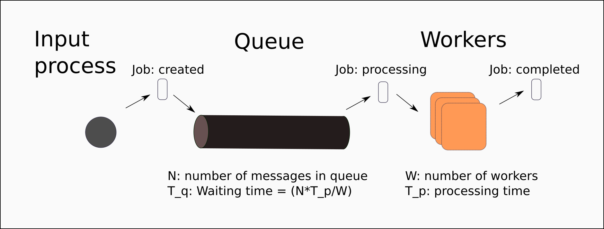

# go-msqueue-worker

Server nhận Request message (POST), đẩy message vào MessageQueue chờ xử lý, WorkerPool thực hiện xử lý message trong queue và tuân theo Rule_Engine để chờ có các action tương ứng

## 1. Yêu cầu
- Go 1.9 hoặc thấp hơn, ubuntu 16.04

## 2. Hướng dẫn

Cấu trúc MessageQueue và WorkerPool 



### 2.1 Định nghĩa MessageQueue
go-messqueue.go:

```
type Message struct {
	Status int // status field to check rule
	Content   string
}

var MaxLenQueue int = 600
// Message Queue
var Queue chan(Message)

// Recv message, push to message queue
func PutMessage(message Message) {
	if len(Queue) < MaxLenQueue{
		Queue <- message
		fmt.Println("Lenght Queue : ", len(Queue))
	}else {
		fmt.Println("Full Queue")
	}
}

```

### 2.2 Định nghĩa WorkerPool

workerpool.go

```
var MaxLenWorker int = 10
// Worker pool
var Worker chan(int)

func CallWorker(idWoker int){
	message := <-messqueue.Queue
	rule_engine.RuleSys(idWoker, message)

	//return worker to pool
	Worker <- idWoker
}

```

### 2.3 Cấu trúc Rule_Engine

rule_engine.go

```
func RuleSys(idWoker int, message messqueue.Message){
	if message.Status == 1{
		fmt.Println("Status 1")
		WriteAppendFile(idWoker, message)
	}else if message.Status == 2{
		fmt.Println("Status 2")
		WriteNewFile(idWoker, message)
	}else {
		fmt.Println("Status not support")
	}
}

func WriteAppendFile(idWorker int, message messqueue.Message) bool{
	fmt.Println("Worker ", idWorker, " execute Message write append file")

	// check exits file output
	if _, err := os.Stat("output.json"); err == nil {
		f, _ := os.OpenFile("output.json", os.O_APPEND|os.O_WRONLY, 0600)
		defer f.Close()
		rs, _ := json.Marshal(message)
		_, er := f.Write(rs)
		if er != nil {
			panic(er)
		}
		return true
	}else {
		jsonData, _  := json.Marshal(message)
		ioutil.WriteFile("output.json", jsonData, 0600)
		return true
	}
	return false
}

func WriteNewFile(idWorker int, message messqueue.Message) bool{
	fmt.Println("Worker ", idWorker ," execute Message write new file")

	// name file = timeNowUnix + .json
	newFile := strconv.FormatInt(time.Now().UnixNano(),10) + ".json"
	jsonData, _  := json.Marshal(message)
	err := ioutil.WriteFile(newFile, jsonData, 0600)
	if err != nil{
		panic(err)
		return false
	}
	return true
}

```

### 2.4 Server

server/server.go

```
func RecMessage(rw http.ResponseWriter, request *http.Request) {
	decoder := json.NewDecoder(request.Body)

	var message go_messqueue.Message
	err := decoder.Decode(&message)

	if err != nil {
		panic(err)
	}
	go_messqueue.PutMessage(message)

	fmt.Println(message.Content)
}


func main() {
	messqueue.Queue = make(chan messqueue.Message, messqueue.MaxLenQueue)
	workerpool.Worker = make(chan int, workerpool.MaxLenWorker)

	for id := 0 ; id < workerpool.MaxLenWorker ; id ++{
		workerpool.Worker <-id
	}

	// Worker execute message in pool, write to disk
	go func() {
		for {
			w := <- workerpool.Worker
			workerpool.CallWorker(w)
		}
	}()
	fmt.Println("Server run at port 8000")
	http.HandleFunc("/message", RecMessage)
	http.ListenAndServe(":8000", nil)
}

```

### 2.5 Chạy chương trình

Để chạy chương trình, vào thư mục $GOPATH/src/github.com/tungct/go-libs

```
$ go run /server/server.go

Server run at port 8000
```
Call REST API với phương thức POST

```
curl -X POST -d '{"status":1,"content":"test"}' http://127.0.0.1:8000/message
```
### 2.6 Test Performance bằng go-wrk

- https://github.com/tsliwowicz/go-wrk

Để test, vào thư mục $GOPATH/bin


```
./go-wrk -M POST -d 5 -body "{\"status\":1,\"content\": \"test\"}" http://127.0.0.1:8000/message
```

Kết quả :

- 1 worker trong workerpool (MaxLenWorker=1)

```
Running 5s test @ http://127.0.0.1:8000/message
  10 goroutine(s) running concurrently
86281 requests in 4.918361348s, 8.15MB read
Requests/sec:		17542.63
Transfer/sec:		1.66MB
Avg Req Time:		570.039µs
Fastest Request:	63.42µs
Slowest Request:	21.826247ms
Number of Errors:	0
```

- 2 worker trong workerpool (MaxLenWorker=2)

```
Running 5s test @ http://127.0.0.1:8000/message
  10 goroutine(s) running concurrently
87194 requests in 4.920370263s, 8.23MB read
Requests/sec:		17721.02
Transfer/sec:		1.67MB
Avg Req Time:		564.301µs
Fastest Request:	61.499µs
Slowest Request:	24.348407ms
Number of Errors:	0
```

- 10 worker trong workerpool (MaxLenWorker=10)

```
Running 5s test @ http://127.0.0.1:8000/message
  10 goroutine(s) running concurrently
87531 requests in 4.914277797s, 8.26MB read
Requests/sec:		17811.57
Transfer/sec:		1.68MB
Avg Req Time:		561.432µs
Fastest Request:	58.769µs
Slowest Request:	18.407424ms
Number of Errors:	0

```

- 20 worker trong workerpool (MaxLenWorker=20)

```
Running 5s test @ http://127.0.0.1:8000/message
  10 goroutine(s) running concurrently
87047 requests in 4.922004624s, 8.22MB read
Requests/sec:		17685.27
Transfer/sec:		1.67MB
Avg Req Time:		565.442µs
Fastest Request:	66.411µs
Slowest Request:	12.811064ms
Number of Errors:	0

```
