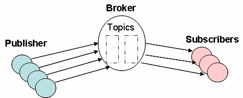
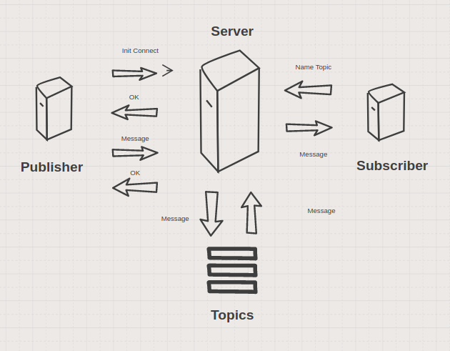

# go-libs

- WorkerPool & RuleEngine : Server nhận Request message (POST), đẩy message vào MessageQueue chờ xử lý, WorkerPool thực hiện xử lý message trong queue và tuân theo Rule_Engine để chờ có các action tương ứng
- Publish & Subscribe : (TCP/IP Socket)Server nhận message từ publisher và đẩy vào topic tương ứng, subscriber gửi yêu cầu đến server lấy phần tử trong topic mong m
uốn

## 1. Yêu cầu
- Go 1.9 hoặc thấp hơn, ubuntu 16.04

## 2. Hướng dẫn

### 2.1 WorkerPool & RuleEngine
Cấu trúc MessageQueue và WorkerPool 


#### 2.1.1 Định nghĩa MessageQueue
messqueue/messqueue.go:

```
type Message struct {
	Status int // status field to check rule
	Content   string
}

var MaxLenQueue int = 600
// Message Queue
var Queue chan(Message)

// Recv message, push to message queue
func PutMessage(message Message) {
	if len(Queue) < MaxLenQueue{
		Queue <- message
		fmt.Println("Lenght Queue : ", len(Queue))
	}else {
		fmt.Println("Full Queue")
	}
}

```

#### 2.1.2 Định nghĩa WorkerPool

workerpool/workerpool.go

```
var MaxLenWorker int = 10
// Worker pool
var Worker chan(int)

func CallWorker(idWoker int){
	message := <-messqueue.Queue
	rule_engine.RuleSys(idWoker, message)

	//return worker to pool
	Worker <- idWoker
}

```

#### 2.1.3 Cấu trúc Rule_Engine

rule_engine/rule_engine.go

```
func RuleSys(idWoker int, message messqueue.Message){
	if message.Status == 1{
		fmt.Println("Status 1")
		WriteAppendFile(idWoker, message)
	}else if message.Status == 2{
		fmt.Println("Status 2")
		WriteNewFile(idWoker, message)
	}else {
		fmt.Println("Status not support")
	}
}

func WriteAppendFile(idWorker int, message messqueue.Message) bool{
	fmt.Println("Worker ", idWorker, " execute Message write append file")

	// check exits file output
	if _, err := os.Stat("output.json"); err == nil {
		f, _ := os.OpenFile("output.json", os.O_APPEND|os.O_WRONLY, 0600)
		defer f.Close()
		rs, _ := json.Marshal(message)
		_, er := f.Write(rs)
		if er != nil {
			panic(er)
		}
		return true
	}else {
		jsonData, _  := json.Marshal(message)
		ioutil.WriteFile("output.json", jsonData, 0600)
		return true
	}
	return false
}

func WriteNewFile(idWorker int, message messqueue.Message) bool{
	fmt.Println("Worker ", idWorker ," execute Message write new file")

	// name file = timeNowUnix + .json
	newFile := strconv.FormatInt(time.Now().UnixNano(),10) + ".json"
	jsonData, _  := json.Marshal(message)
	err := ioutil.WriteFile(newFile, jsonData, 0600)
	if err != nil{
		panic(err)
		return false
	}
	return true
}

```

#### 2.1.4 Server

server/server.go

```
func RecMessage(rw http.ResponseWriter, request *http.Request) {
	decoder := json.NewDecoder(request.Body)

	var message go_messqueue.Message
	err := decoder.Decode(&message)

	if err != nil {
		panic(err)
	}
	go_messqueue.PutMessage(message)

	fmt.Println(message.Content)
}


func main() {
	messqueue.Queue = make(chan messqueue.Message, messqueue.MaxLenQueue)
	workerpool.Worker = make(chan int, workerpool.MaxLenWorker)

	for id := 0 ; id < workerpool.MaxLenWorker ; id ++{
		workerpool.Worker <-id
	}

	// Worker execute message in pool, write to disk
	go func() {
		for {
			w := <- workerpool.Worker
			workerpool.CallWorker(w)
		}
	}()
	fmt.Println("Server run at port 8000")
	http.HandleFunc("/message", RecMessage)
	http.ListenAndServe(":8000", nil)
}

```

#### 2.1.5 Chạy chương trình

Để chạy chương trình, vào thư mục $GOPATH/src/github.com/tungct/go-libs

```
$ go run /server/server.go

Server run at port 8000
```
Call REST API với phương thức POST

```
curl -X POST -d '{"status":1,"content":"test"}' http://127.0.0.1:8000/message
```
#### 2.1.6 Test Performance bằng go-wrk

- https://github.com/tsliwowicz/go-wrk

Để test, vào thư mục $GOPATH/bin


```
./go-wrk -M POST -d 5 -body "{\"status\":1,\"content\": \"test\"}" http://127.0.0.1:8000/message
```

Kết quả chạy trên máy tính RAM 4 Gigabyte :

- 1 worker trong workerpool (MaxLenWorker=1)

```
Running 5s test @ http://127.0.0.1:8000/message
  10 goroutine(s) running concurrently
86281 requests in 4.918361348s, 8.15MB read
Requests/sec:		17542.63
Transfer/sec:		1.66MB
Avg Req Time:		570.039µs
Fastest Request:	63.42µs
Slowest Request:	21.826247ms
Number of Errors:	0
```

- 2 worker trong workerpool (MaxLenWorker=2)

```
Running 5s test @ http://127.0.0.1:8000/message
  10 goroutine(s) running concurrently
87194 requests in 4.920370263s, 8.23MB read
Requests/sec:		17721.02
Transfer/sec:		1.67MB
Avg Req Time:		564.301µs
Fastest Request:	61.499µs
Slowest Request:	24.348407ms
Number of Errors:	0
```

- 10 worker trong workerpool (MaxLenWorker=10)

```
Running 5s test @ http://127.0.0.1:8000/message
  10 goroutine(s) running concurrently
87531 requests in 4.914277797s, 8.26MB read
Requests/sec:		17811.57
Transfer/sec:		1.68MB
Avg Req Time:		561.432µs
Fastest Request:	58.769µs
Slowest Request:	18.407424ms
Number of Errors:	0

```

- 20 worker trong workerpool (MaxLenWorker=20)

```
Running 5s test @ http://127.0.0.1:8000/message
  10 goroutine(s) running concurrently
87047 requests in 4.922004624s, 8.22MB read
Requests/sec:		17685.27
Transfer/sec:		1.67MB
Avg Req Time:		565.442µs
Fastest Request:	66.411µs
Slowest Request:	12.811064ms
Number of Errors:	0

```
### 2.2 Publish & Subscribe 
Kiến trúc chung Publish & Subscribe



Kiến trúc trong chương trình



#### 2.2.1 Định nghĩa Message 

messqueue/messqueue.go:

```
const InitConnectStatus = 1
const PublishStatus = 2
const SubscribeStatus = 3
const NilMessageStatus = -1


func CreateMessage(status int, content string) Message{
	var message Message
	message.Status = status
	message.Content = content
	return message
}

func PutMessageToTopic(message Message, queue MessQueue){
	if len(queue) < 10{
		queue <- message
		fmt.Println("Lenght Queue : ", len(queue))
	}else {
		fmt.Println("Full Queue")
	}
}


```

#### 2.2.2 Định nghĩa topic 
topic/topic.go:

```
type Topic struct {
	Name string
	MessQueue messqueue.MessQueue
}

// classifer message to many topic
func RuleTopic(mess messqueue.Message) string{
	var topicName string
	if strings.Contains(mess.Content, "Message"){
		topicName = "Message"
	}else {
		topicName = "other"
	}
	return topicName
}

func PrintTopic(listTopic []Topic) {
	for _, tp := range listTopic{
		fmt.Println(tp.Name)
	}
}

func InitTopic(name string, len int) Topic{
	var topic Topic
	topic.Name = name
	topic.MessQueue = messqueue.InitQueue(len)
	return topic
}

func GetIndexTopic(name string, listTopic []Topic) int {
	for i, tp := range listTopic {
		if tp.Name == name {
			return i
		}
	}
	return -1
}

func PublishToTopic(topic Topic, message messqueue.Message){
	messqueue.PutMessageToTopic(message, topic.MessQueue)
}

func Subscribe(topic Topic) (succ bool, ms messqueue.Message){
	var message interface{}
	var er bool = false
	if len(topic.MessQueue )> 0{
		message = <- topic.MessQueue
		er = true
	}
	mess := message.(messqueue.Message)
	return er, mess
}

```

#### 2.2.3 Server 

socket/server.go

```
var Topics [] Topic.Topic

const lenTopic = 10


func HandleConnection(conn net.Conn) {
	dec := gob.NewDecoder(conn)
	mess := &messqueue.Message{}
	dec.Decode(mess)

	// status 1 : Init connect
	if mess.Status == 1{
		conn.Write([]byte("OK"))
		fmt.Printf("Received : %+v \n", mess);
		conn.Close()

	// status 2 : Publish message
	}else if mess.Status == 2{
		topicName := Topic.RuleTopic(*mess)
		indexTopic := Topic.GetIndexTopic(topicName, Topics)

		// if topicName is not in topics, create new topic
		if indexTopic == -1{
			topic := Topic.InitTopic(topicName, lenTopic)
			Topic.PublishToTopic(topic, *mess)
			Topics = append(Topics, topic)
		}else{
			Topic.PublishToTopic(Topics[indexTopic], *mess)
		}
		Topic.PrintTopic(Topics)
		conn.Write([]byte("Success"))
		fmt.Printf("Received : %+v \n", mess);
		conn.Close()

	// status 3 : Subscribe message
	}else if mess.Status == 3{
		var messResponse messqueue.Message
		//topicName, _ := strconv.Atoi(mess.Content)
		topicName := Topic.RuleTopic(*mess)
		indexTopic := Topic.GetIndexTopic(topicName, Topics)

		// if exits topicName in topics
		if indexTopic != -1 {
			// if not message in topic
			if len(Topics[indexTopic].MessQueue) != 0{
				_, messResponse = Topic.Subscribe(Topics[indexTopic])
				encoder := gob.NewEncoder(conn)
				encoder.Encode(messResponse)
				conn.Close()
			}else{
				messResponse = messqueue.CreateMessage(messqueue.NilMessageStatus, "Not message in topic")
				encoder := gob.NewEncoder(conn)
				encoder.Encode(messResponse)
				conn.Close()
			}
		}else {
			messResponse = messqueue.CreateMessage(messqueue.NilMessageStatus, "Not exits topic")
			encoder := gob.NewEncoder(conn)
			encoder.Encode(messResponse)
			conn.Close()
		}
		fmt.Println("Subscribe Topic ", topicName)
		return
	}
}

func main() {
	fmt.Println("Server listion at port 8080");
	ln, err := net.Listen("tcp", ":8080")
	if err != nil {
		// handle error
	}
	for {
		conn, err := ln.Accept() // this blocks until connection or error
		if err != nil {
			// handle error
			continue
		}
		go HandleConnection(conn) // a goroutine handles conn so that the loop can accept other connections
	}
}


```
#### 2.2.4 Publisher 

socket/publish_client.go:

```
func BytesToString(data []byte) string {
	return string(data[:])
}

func InitConn(ip string, port int) bool{
	addr := strings.Join([]string{ip, strconv.Itoa(port)}, ":")
	conn, err := net.Dial("tcp", addr)
	if err != nil {
		log.Fatal("Connection error", err)
		return false
	}
	encoder := gob.NewEncoder(conn)

	// Init connect to server
	mess := messqueue.CreateMessage(messqueue.InitConnectStatus, "Init")
	encoder.Encode(mess)
	buff := make([]byte, 1024)
	n, _ := conn.Read(buff)
	log.Printf("Receive: %s", buff[:n])
	if BytesToString(buff[:n]) != "OK"{
		return false
	}
	conn.Close()
	fmt.Println("done");
	return true
}

func SendMess(ip string, port int){
	addr := strings.Join([]string{ip, strconv.Itoa(port)}, ":")
	conn, err := net.Dial("tcp", addr)
	if err != nil {
		log.Fatal("Connection error", err)
	}
	encoder := gob.NewEncoder(conn)

	// Publish message
	mess := messqueue.CreateMessage(messqueue.PublishStatus, "Message")
	encoder.Encode(mess)
	buff := make([]byte, 1024)
	n, _ := conn.Read(buff)
	log.Printf("Receive: %s", buff[:n])
	conn.Close()
	fmt.Println("done");
}


func main() {
	var (
		ip   = "127.0.0.1"
		port = 8080
	)
	fmt.Println("start client");
	succ := InitConn(ip, port)
	if succ == true{
		SendMess(ip, port)
	}
}

```

#### 2.2.5 Subscriber 

socket/subscribe_client.go

```
func GetMess(ip string, port int, topicName string){
	addr := strings.Join([]string{ip, strconv.Itoa(port)}, ":")
	conn, err := net.Dial("tcp", addr)
	if err != nil {
		log.Fatal("Connection error", err)
	}
	encoder := gob.NewEncoder(conn)

	// subscribe topic with topicName
	mess := messqueue.CreateMessage(messqueue.SubscribeStatus, topicName)
	encoder.Encode(mess)
	dec := gob.NewDecoder(conn)
	messRes := &messqueue.Message{}
	dec.Decode(messRes)
	conn.Close()
	fmt.Println(messRes);
}

func main() {
	var (
		ip   = "127.0.0.1"
		port = 8080
	)
	fmt.Println("start client");
	GetMess(ip, port, "Message")
}
```


